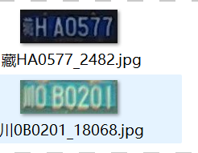
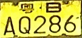
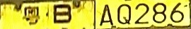

## **最全车牌识别算法，支持12种中文车牌类型**

**环境要求: python >=3.6  pytorch >=1.7**

如何运行？

直接运行detect_plate.py 或者运行如下命令行：

```
python detect_plate.py --detect_model weights/plate_detect.pt  --rec_model weights/plate_rec_color.pth --image_path imgs --output result
```

## 数据集准备
D:/datasets/images用于存放图片，/train存放训练图片，/val存放验证图片，/test存放测试图片。
D:/datasets/labels用于存放标签，格式同上。
通过data_process.py导入图片，mode2导入标签（.json），通过json2yolo.py转换成所需格式（.txt）

视频功能暂未实现：
```
python detect_plate.py --detect_model weights/plate_detect.pt  --rec_model weights/plate_rec_color.pth --video 2.mp4
```

## 车牌检测模型训练
```
python train.py
```

## 车牌识别数据集准备
   

   图片命名如上图：**车牌号_序号.jpg**
   如何得到小图？
   运行detect_plate.py，会在datasets/det_results生成小图，运行data_process.py进行重命名，
   然后放入datasets/rec_train和datasets/rec_val，
   执行如下命令，给数据集打上标签,生成train.txt和val.txt

   ```
   python rec_plateLabel.py --image_path D:/datasets/images/rec_train/ --label_file datasets/train.txt
   python rec_plateLabel.py --image_path D:/datasets/images/rec_val/ --label_file datasets/val.txt
   ```

   数据格式如下：
   train.txt
   ```
   /mnt/Gu/trainData/plate/new_git_train/CCPD_CRPD_ALL/冀BAJ731_3.jpg 5 53 52 60 49 45 43 
   /mnt/Gu/trainData/plate/new_git_train/CCPD_CRPD_ALL/冀BD387U_2454.jpg 5 53 55 45 50 49 70 
   /mnt/Gu/trainData/plate/new_git_train/CCPD_CRPD_ALL/冀BG150C_3.jpg 5 53 58 43 47 42 54 
   /mnt/Gu/trainData/plate/new_git_train/CCPD_CRPD_OTHER_ALL/皖A656V3_8090.jpg 13 52 48 47 48 71 45 
   /mnt/Gu/trainData/plate/new_git_train/CCPD_CRPD_OTHER_ALL/皖C91546_7979.jpg 13 54 51 43 47 46 48 
   /mnt/Gu/trainData/plate/new_git_train/CCPD_CRPD_OTHER_ALL/皖G88950_1540.jpg 13 58 50 50 51 47 42 
   /mnt/Gu/trainData/plate/new_git_train/CCPD_CRPD_OTHER_ALL/皖GX9Y56_2113.jpg 13 58 73 51 74 47 48 
   ```

   将train.txt  val.txt路径写入lib/config/rec_data.yaml 中

   ```
   DATASET:
     DATASET: 360CC
     ROOT: ""
     CHAR_FILE: 'lib/dataset/txt/plate2.txt'
     JSON_FILE: {'train': 'datasets/train.txt', 'val': 'datasets/val.txt'}
   ```

## 车牌识别模型Train

```
python rec_train.py --cfg lib/config/rec_data.yaml
```

结果保存在output文件夹中


## 导出onnx

```

python export.py --weights saved_model/best.pth --save_path saved_model/best.onnx  --simplify

```


#### onnx 推理

```
python onnx_infer.py --onnx_file saved_model/best.onnx  --image_path images/test.jpg
```

## 双层车牌

双层车牌这里采用拼接成单层车牌的方式：

python:

```
def get_split_merge(img):
    h,w,c = img.shape
    img_upper = img[0:int(5/12*h),:]
    img_lower = img[int(1/3*h):,:]
    img_upper = cv2.resize(img_upper,(img_lower.shape[1],img_lower.shape[0]))
    new_img = np.hstack((img_upper,img_lower))
    return new_img
```

c++:

```
cv::Mat get_split_merge(cv::Mat &img)   //双层车牌 分割 拼接
{
    cv::Rect  upper_rect_area = cv::Rect(0,0,img.cols,int(5.0/12*img.rows));
    cv::Rect  lower_rect_area = cv::Rect(0,int(1.0/3*img.rows),img.cols,img.rows-int(1.0/3*img.rows));
    cv::Mat img_upper = img(upper_rect_area);
    cv::Mat img_lower =img(lower_rect_area);
    cv::resize(img_upper,img_upper,img_lower.size());
    cv::Mat out(img_lower.rows,img_lower.cols+img_upper.cols, CV_8UC3, cv::Scalar(114, 114, 114));
    img_upper.copyTo(out(cv::Rect(0,0,img_upper.cols,img_upper.rows)));
    img_lower.copyTo(out(cv::Rect(img_upper.cols,0,img_lower.cols,img_lower.rows)));
    return out;
}
```

  通过变换得到 

## 训练自己的数据集

1. 修改alphabets.py，修改成你自己的字符集，plateName,plate_chr都要修改，plate_chr 多了一个空的占位符'#'
2. 通过plateLabel.py 生成train.txt, val.txt
3. 训练

## 数据增强

```
cd Text-Image-Augmentation-python-master

python demo1.py --src_path /mnt/Gu/trainData/test_aug --dst_path /mnt/Gu/trainData/result_aug/
```

src_path 是数据路径， dst_path是保存的数据路径

**然后把两份数据放到一起进行训练，效果会好很多！**


